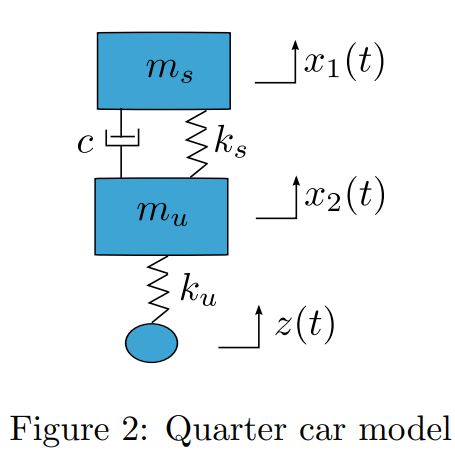

This file represents the implementation of a simple system identification method, using the SysIdentPy library to create the NARX model for a certain mechanical system.

What is dynamical system we are representing? 

We are trying to represent x1 with respect to t for the following mechanical system, representing 2 connected objects being forced externally to oscilate:

